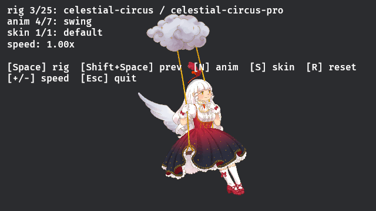

# dm_spine_bevy

Bevy 0.18 integration for [`dm_spine_runtime`](https://github.com/dead-money/dm_spine_runtime), the native Rust port of the [Spine](https://esotericsoftware.com/) 4.2 runtime.

<p align="center">
  
</p>

This crate is the thin layer that maps the runtime's renderer-agnostic `RenderCommand` stream onto Bevy meshes and materials. It supports both Bevy's 2D (`Material2d` / sprite) pipeline and its 3D (`Material` / PBR) pipeline — skeletons opt in per-entity via a marker component. The runtime crate itself has no GPU or windowing dependency; this one knows about wgpu, Bevy's material traits, and the Bevy ECS.

> **About this project.** This crate is built for Dead Money's internal game projects and was primarily authored by AI agents (Claude Code) driving an integration of an in-house Spine 4.2 runtime port into Bevy, with a human engineer directing scope, reviewing output, and steering architecture. It's published for transparency and for use inside Dead Money, not as a polished third-party plugin. APIs will shift, edge cases beyond what our own game needs may be unhandled, and documentation leans toward "what would a maintainer need?" rather than "what would a brand-new user expect?". If you adopt it anyway, expect to file issues and read source occasionally.

## You need a Spine Editor license to use this

This crate inherits the license obligations of `dm_spine_runtime`, which is a derivative of Esoteric Software's `spine-cpp`. Distribution is governed by the [Spine Editor License Agreement](https://esotericsoftware.com/spine-editor-license) and the [Spine Runtimes License Agreement](https://esotericsoftware.com/spine-runtimes-license). In practical terms:

- **Every end user of software built with this crate must hold their own [Spine Editor license](https://esotericsoftware.com/spine-purchase).** Same obligation as every official Spine runtime.
- **Copyright and license notices must be preserved.** Every source file carries the Esoteric Software copyright block; the `LICENSE` file reproduces the Spine Runtimes License verbatim.

If your use case is in doubt, consult the [Spine licensing page](https://esotericsoftware.com/spine-purchase) or contact Esoteric Software directly.

## Compatibility

- **Bevy 0.18.x.** Pinned to a specific Bevy version because the rendering pipeline ties into `Material2d` specialization and the `Mesh2d` extraction model, both of which evolve across releases.
- **Spine 4.2** exports in either binary `.skel` or JSON `.json` format, paired with a `.atlas`.

## What's in the box

- **`SpinePlugin`** — registers the asset loaders, both the 2D (`Material2d`) and 3D (`Material`) flavors of the PMA material, the per-frame system schedule, and a pair of buffered events for animation lifecycle + keyframe firings.
- **Asset pipeline** — `SpineAtlasAsset` and `SpineSkeletonAsset` load via Bevy's standard `AssetServer`, with PNG dependencies resolved automatically. The atlas asset doubles as the `TextureId(u32) → Handle<Image>` resolution table for the renderer.
- **`SpineSkeleton` component** — per-instance state (skeleton + animation + renderer). Two-stage init: spawn with a `Handle<SpineSkeletonAsset>` and the runtime state lazily constructs once the asset finishes loading. Helpers cover the common cases:
  - `play(track, name, looping)` to start an animation
  - `set_skin(name)` to swap skins (re-resolves slot attachments)
  - `with_initial_animation` / `with_initial_skin` builder setters for spawn-time defaults
  - `available_animations()` / `available_skins()` for runtime discovery
  - `time_scale`, `physics`, `paused` fields for playback control
  - `animation_state_mut()` / `skeleton_mut()` for direct runtime access when the helpers aren't enough
- **Render-mode markers** — `SpineRender2d` (default, auto-inserted) vs `SpineRender3d` select whether a skeleton is drawn through Bevy's 2D (sprite) pipeline or 3D (PBR-compatible) pipeline. Mutually exclusive per entity; the plugin registers both pipelines and dispatches mesh building per marker, so a single `App` can host 2D and 3D Spine skeletons side by side.
- **PMA materials** — `SpineMaterial` (2D `Material2d`) and `SpineMaterial3d` (3D `Material`) share a shader body: premultiplied-alpha blending with per-blend-mode pipeline specialization for Normal / Additive / Multiply / Screen, plus tint-black via the runtime's `dark_color` channel. Both are unlit. The 3D variant disables back-face culling (Spine meshes are single-sided) and depth writes (slot ordering is handled by the transparent-pass camera sort), and its shadow / prepass are off by design.
- **Per-instance event streams** — `SpineStateEvent` (lifecycle: `Start` / `Interrupt` / `End` / `Complete` / `Dispose`) and `SpineKeyframeEvent` (timeline-fired keyframes) are emitted as Bevy `Message`s, tagged with the source entity.

## What's explicitly out of scope

- **Straight-alpha atlases.** The shipped materials assume PMA. See [Atlas expectations](#atlas-expectations) below for the two workarounds; auto-detect is a planned follow-up.
- **Lit Spine materials.** The 3D material is unlit by design — Spine's light/dark color channels already bake authored tint and the atlas is premultiplied. Layering PBR lighting on top would double-count both. A lit extension could live alongside the shipped material if a concrete need shows up.
- **Billboard / camera-facing skeletons.** The 3D backend draws each skeleton as a flat plane in its local XY plane; `Transform` rotates the whole rig, but there's no built-in "always face the camera" mode. Billboard behavior is a straightforward user-side system (rotate the parent to face the camera each frame) and can ship as a helper later if folks want it.
- **Pre-built UI / inspector.** Direct ECS access; no editor.

## Quick start

```toml
[dependencies]
bevy = "0.18"
dm_spine_runtime = { git = "https://github.com/dead-money/dm_spine_runtime" }
dm_spine_bevy = { git = "https://github.com/dead-money/dm_spine_bevy" }
```

```rust
use bevy::prelude::*;
use dm_spine_bevy::{
    SpinePlugin, SpineSkeleton, SpineSkeletonAsset, SpineSkeletonLoaderSettings,
};

fn main() {
    App::new()
        .add_plugins(DefaultPlugins)
        .add_plugins(SpinePlugin)
        .add_systems(Startup, setup)
        .run();
}

fn setup(mut commands: Commands, asset_server: Res<AssetServer>) {
    commands.spawn(Camera2d);

    // load_with_settings lets you override the atlas path. Without it,
    // the loader derives the atlas filename from the skeleton stem
    // (stripping -pro / -ess / -ios suffixes). Both `.skel` (binary) and
    // `.json` extensions are routed to the right parser automatically —
    // swap the extension and use `SpineSkeletonJsonLoaderSettings` for
    // JSON exports.
    let skel: Handle<SpineSkeletonAsset> = asset_server.load_with_settings(
        "spineboy/export/spineboy-pro.skel",
        |s: &mut SpineSkeletonLoaderSettings| {
            s.atlas_path = Some("spineboy/export/spineboy-pma.atlas".into());
        },
    );

    commands.spawn(
        SpineSkeleton::new(skel).with_initial_animation(0, "walk", true),
    );
}
```

`examples/spineboy_walk.rs` is the runnable version of this snippet.

## Examples

All examples live under `examples/`. They expect the upstream [`spine-runtimes`](https://github.com/EsotericSoftware/spine-runtimes) repo as a sibling clone (`../spine-runtimes`) to load the canonical sample art — that art is licensed separately and does not ship with this crate.

- `cargo run --example spine_browser` — interactive gallery. Walks every rig under the upstream examples directory and lets you cycle them with the keyboard:
  - **Space** / **Shift+Space** — next / previous rig
  - **N** / **Shift+N** — next / previous animation
  - **S** / **Shift+S** — next / previous skin
  - **R** — reset the current animation
  - **+** / **-** — playback speed
  - **Esc** — quit

  Camera live-fits to each rig's AABB, so spineboy and dragon both frame correctly. Asset root is configurable via `--assets <path>`, `SPINE_EXAMPLES_DIR`, or the sibling-clone fallback.

- `cargo run --example spineboy_walk` — minimal "load, play, render" snippet. The shortest readable example of using the plugin.

- `cargo run --example spineboy_walk_3d` — 3D sibling of `spineboy_walk`. Same rig + walk animation, drawn through the `SpineMaterial3d` / `Material` pipeline on a perspective `Camera3d`, sitting on a ground plane with a directional light and a slow orbit camera. Opting a skeleton into the 3D pipeline is a one-component change: spawn `SpineRender3d` alongside `SpineSkeleton`. `SPINE_SCREENSHOT_3D` + `SPINE_SCREENSHOT_3D_FRAMES` trigger the same headless screenshot flow as the 2D example.

- `cargo run --example spineboy_screenshot` — headless-friendly sibling of `spineboy_walk`. Runs N frames then writes a PNG via Bevy's `Screenshot` API. Used in CI / for visual regression checks. `SPINE_SCREENSHOT` and `SPINE_SCREENSHOT_FRAMES` configure output.

- `cargo run --release --example spine_stress` — stress test. Spawns N skeletons (default 1) in a perfect-square grid centered on the origin, all running spineboy's `run` animation with per-instance time offsets. Press **]** to step up to the next square (1 → 4 → 9 → 16 → …) and **[** to step down. **R** resets, **Esc** quits. HUD reports `fps / tick_ms / build_ms` via Bevy diagnostics. Run with `--release` — debug builds skew the numbers heavily. CSV export: `--csv path.csv` writes `frame,count,fps,tick_ms,build_ms` per frame. On the dev machine (RTX 4090 + i9-14900K, 16 cores) per-skeleton CPU cost is ~3 µs at scale once the tick stage parallelizes via `par_iter_mut`: 1 skeleton 0.08 ms, 50 skeletons 0.25 ms, 1000 skeletons 2.75 ms. Real-world bottleneck above ~1000 instances becomes GPU-side mesh upload + draw calls rather than CPU.

### Recording animated previews

The browser also has a frame-sequence record mode for assembling animated previews like the GIF at the top of this README. Pin a rig + animation, set a window size, capture N frames into a directory, and stitch with ImageMagick / ffmpeg. The reference command used to produce `docs/celestial-circus-swing.gif` is:

```sh
mkdir -p /tmp/celestial_frames
SPINE_BROWSER_RECORD_DIR=/tmp/celestial_frames \
SPINE_BROWSER_RECORD_FRAMES=120 \
SPINE_BROWSER_RECORD_WARMUP=45 \
cargo run --example spine_browser -- \
    --rig celestial-circus-pro --anim swing --width 640 --height 360

# 60-frame, ~30 fps optimized GIF (~1 MB).
ls /tmp/celestial_frames/frame_*.png | awk 'NR%2==1' | xargs \
    convert -delay 3 -loop 0 -layers OptimizePlus docs/your-clip.gif
```

`SPINE_BROWSER_RECORD_WARMUP` exists so the live-fit camera has time to settle on the new rig before recording starts.

## Atlas expectations

The built-in material assumes **premultiplied-alpha** textures and applies the PMA blending equations (`ONE, ONE_MINUS_SRC_ALPHA` for Normal, `ONE, ONE` for Additive, etc.). Most Spine exports ship `*-pma.atlas` / `*-pma.png` variants alongside the straight-alpha pair — prefer the PMA variant.

Two workarounds for non-PMA atlases:

1. Override the atlas path on load (as in the quick-start above) to point at the PMA variant.
2. Pre-multiply your PNGs as part of your asset pipeline before they enter `assets/`.

Auto-detection of the atlas's `pma:` flag and on-load premultiplication is a planned follow-up.

## How the integration fits together

Per-frame the plugin runs five ordered system sets in `Update`:

1. **`SpineSet::EnsureMarkers`** — backfills `SpineRender2d` on any `SpineSkeleton` entity that doesn't already carry a render-mode marker. Keeps the default-spawn path (plain `commands.spawn(SpineSkeleton::new(...))`) rendering through the 2D pipeline, so existing code works unchanged.
2. **`SpineSet::Init`** — observes assets that finished loading; constructs the `SpineSkeletonState` (skeleton + animation state + renderer) in place; applies any pending animation / skin from spawn-time builder settings.
3. **`SpineSet::Tick`** — advances time, applies timelines, recomputes world transforms, re-emits the render-command stream into the renderer's internal buffer.
4. **`SpineSet::BuildMeshes`** — converts the new `&[RenderCommand]` into Bevy children, mutating in place via `Assets::get_mut`. Two sibling systems run here, filtered by render-mode marker: `build_spine_meshes` spawns `(Mesh2d, MeshMaterial2d<SpineMaterial>)` for `SpineRender2d` entities; `build_spine_meshes_3d` spawns `(Mesh3d, MeshMaterial3d<SpineMaterial3d>)` for `SpineRender3d` entities. Child entities are reused across frames; commands beyond the current frame's count are hidden, not despawned.
5. **`SpineSet::Events`** — drains lifecycle + keyframe events into `SpineStateEvent` / `SpineKeyframeEvent` writers.

User systems can `.before(SpineSet::Tick)` to mutate `time_scale` / queue animations on the same frame they take effect.

Other architectural notes:

- One `RenderCommand` becomes one child entity. Each child carries a small per-index Z offset along the skeleton's local +Z. In 2D, `Transparent2d`'s back-to-front sort relies on this offset directly. In 3D, `Transparent3d` sorts by camera distance and the 3D material disables depth writes, so slot ordering survives as long as the camera isn't at an extreme grazing angle to the skeleton's local plane.
- `SkeletonData` is `Arc`-shared across instances of the same rig. Spawning ten of one rig is ten `Arc::clone`s, not ten deep loads.
- The runtime's adjacency batcher (merging same-`(texture, blend, color)` runs) is preserved end-to-end. Spineboy typically renders as one mesh.
- Per-skeleton storage carries two material-handle vecs (`materials` for 2D, `materials_3d` for 3D); the inactive one is empty. The cost is a few empty `Vec` headers per skeleton and keeps the per-backend mesh-build systems as independent `Query` views over the same component.

## Testing

```sh
cargo check --all-targets
cargo test                # unit + integration
cargo clippy --all-targets
cargo run --example spine_browser
```

`tests/plugin_registers.rs` and `tests/plugin_registers_3d.rs` exercise the plugin under a minimal headless app — confirms registration, asset-loading, render-mode marker backfill, and one update tick all run without panicking for both pipelines.

## Related crates

- [`dm_spine_runtime`](https://github.com/dead-money/dm_spine_runtime) — the renderer-agnostic core this crate depends on. Data loaders, skeleton pose, animation state, constraints, clipping, bounds, render-command emission.

## License

Distributed under the [Spine Runtimes License Agreement](https://esotericsoftware.com/spine-runtimes-license). See [`LICENSE`](./LICENSE) for the full text.

Copyright © 2013-2025 Esoteric Software LLC. Bevy integration © Dead Money, published under the same license.
